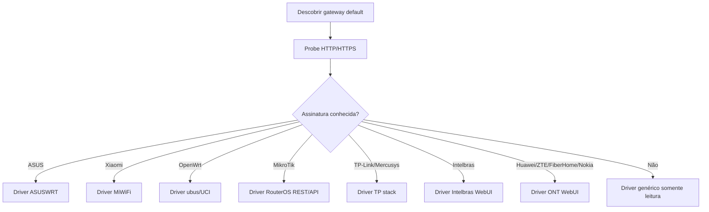

# Drivers locais para o SignallQ em gateways residenciais no Brasil

## Resumo executivo

Para o objetivo que você descreveu — um app local na LAN, sem depender da operadora, capaz de descobrir o roteador/ONT, ler estado e executar ações básicas como trocar SSID, senha, canal e reiniciar — o caminho mais viável não é tentar um “driver universal mágico”, e sim um **motor de descoberta + seleção de driver por família de firmware**. Na prática, os alvos mais promissores para um MVP no Brasil são: **TP-Link/Mercusys** no varejo, **Huawei/ZTE/Nokia/FiberHome** em ONTs/gateways de operadora, **Intelbras** no varejo nacional, e duas plataformas que simplificam muito a vida quando presentes: **OpenWrt** e **MikroTik RouterOS**. Esses dois últimos são os únicos do conjunto com APIs locais relativamente limpas e previsíveis por documentação oficial. citeturn12search1turn22search4turn32search0turn32search1turn29search2turn6search16turn35search0turn33search1

O ponto crítico é este: **em muitos ONTs de operadora não existe API pública estável**, e o que há é GUI web com formulários HTML, páginas internas e, em alguns casos, endpoints `goform` ou CGI não documentados. Isso vale especialmente para **FiberHome**, várias linhas **ZTE** e muitas **Huawei EchoLife**. Nesses casos, o SignallQ precisa operar como cliente autenticado do WebUI local, com captura de sessão/cookies/tokens e scraping de páginas ou POSTs internos por modelo/firmware. Já em **Xiaomi MiWiFi** e **ASUSWRT** há endpoints locais conhecidos pela comunidade; em **TP-Link/Mercusys** a interface existe, mas é bastante fragmentada por geração de firmware e costuma usar senha “web encrypted”, AES/CBC ou AES/GCM, o que aumenta o trabalho. citeturn26view2turn26view3turn36view0turn36view4turn30view0turn30view1turn21search3turn16view0turn17view4

A recomendação prática para o MVP é brutalmente simples: **implemente primeiro os drivers com melhor relação cobertura/estabilidade/esforço**. Ordem sugerida: **OpenWrt**, **MikroTik**, **TP-Link/Mercusys**, **ASUS**, **Intelbras**, depois **ZTE**, **Huawei**, **Nokia** e **FiberHome**. Isso porque OpenWrt e MikroTik têm superfícies de integração muito melhores; TP-Link/Mercusys e ASUS têm base instalada boa e operações ricas; Intelbras é relevante no mercado brasileiro; e ONTs de operadora dão cobertura real, mas cobram caro em engenharia por causa de firmware customizado, telas escondidas, ACLs e reprovisionamento via ACS/TR-069/OMCI. citeturn12search1turn22search4turn32search0turn17view0turn19view1turn29search2turn28view0turn26view3turn34search10

## Escopo e método

Este relatório foi montado com foco em **controle local pela LAN/Wi‑Fi**, sem cloud do fabricante e sem backend da operadora. Onde a documentação oficial descreve só a GUI e não expõe endpoints, eu trato isso como “driver por WebUI” e marco os detalhes de endpoint como **model-specific**. Onde há evidência forte de comunidade ou integração open source, eu uso isso como base operacional, mas sempre separando o que é oficial do que é reversão de API. citeturn26view3turn28view0turn19view1turn16view0turn30view0turn36view0

Também é importante não inventar precisão onde ela não existe. Não encontrei uma base pública única e confiável que dê “market share” exato de CPE residencial por fabricante no Brasil. Em vez de chutar, usei um critério mais honesto: **presença pública em catálogos/suporte brasileiros e em bases de operadoras**, por exemplo as páginas da Claro para Huawei, ZTE e Nokia, além dos portais brasileiros de TP-Link, Intelbras e Mercusys. Isso sustenta a relevância local, mas **não** deve ser lido como ranking estatístico fechado de participação de mercado. citeturn33search11turn35search0turn33search1turn6search15turn29search2turn3search16

## Arquitetura recomendada de descoberta e normalização

O SignallQ deve tratar a descoberta como um pipeline em camadas: primeiro detectar **gateway default + portas HTTP/HTTPS**, depois identificar **banner, título HTML, paths padrões, cookies, nomes de host locais e pistas de JavaScript**, e só então escolher o driver. Em alguns fabricantes, o hostname ajuda muito: `asusrouter.com` na ASUS; `http://192.168.1.1` ou `meuintelbras.local` em Intelbras; IPs típicos como `192.168.1.254` em Huawei/Nokia e `192.168.31.1` em Xiaomi. Em OpenWrt, a presença de `ubus/rpcd/LuCI`; em MikroTik, `/rest` ou WebFig/RouterOS; em ZTE/FiberHome, estruturas `goform` e páginas de status de WAN/WLAN; em Xiaomi, `cgi-bin/luci/;stok=...`; em ASUS, `login.cgi` e `appGet.cgi`. citeturn21search10turn5search19turn29search0turn7search4turn28view0turn31search7turn13view0turn12search1turn36view0turn30view0turn21search3



A camada de autenticação deve ser desacoplada do driver. Você vai precisar suportar, no mínimo, estes padrões: **form login simples**, **cookie de sessão**, **Basic Auth**, **token em path ou cookie**, **CSRF**, e alguns desafios proprietários. ZTE LTE/5G e alguns NG routers usam fluxo com `LD`, `RD`, `AD` e cookie `stok`; Xiaomi usa `/cgi-bin/luci/api/xqsystem/login` e injeta `stok` no path; MikroTik REST usa **HTTP Basic Auth**; OpenWrt via ubus usa **JSON-RPC com sessão**; TP-Link/Mercusys frequentemente exigem senha “web encrypted” e variam entre gerações; ASUS usa o mesmo backend do WebUI e do app, com `login.cgi`/`appGet.cgi`. citeturn36view0turn36view4turn30view0turn31search7turn13view3turn13view0turn17view4turn21search3

Uma boa normalização de dados para o SignallQ é esta: `device_info`, `wan_ipv4`, `wan_ipv6`, `dns`, `wifi_radios`, `wifi_networks`, `clients`, `firmware`, `uptime`, `actions`. Isso casa bem com o que as GUIs oficiais mostram em Huawei, Nokia e FiberHome, e também com as leituras mais estruturadas que OpenWrt, MikroTik, TP-Link wrappers e ASUS entregam. citeturn26view3turn28view0turn22search1turn12search1turn17view4turn19view1

## Drivers de ONTs e gateways de operadora

### Huawei

Para Huawei residencial no Brasil, os modelos mais visíveis publicamente em suporte de operadora são **HG8145V5** e **HG8245Q2/HG8245H**. A Claro mantém guias para HG8145V5 e HG8245Q2; a própria Huawei documenta em seus materiais de ONT o acesso ao WebUI, a alteração de Wi‑Fi em **WLAN Basic Configuration** e a consulta a páginas como **User Device Information**. Em varios guias de ONT, o IP de gestão aparece como `192.168.1.254`, mas a Huawei também diz que o IP/credenciais podem seguir a etiqueta do equipamento; em CPEs não-ONT da linha consumer o padrão comum é `192.168.3.1`, então o heurístico certo para SignallQ é: **tentar gateway atual, depois 192.168.1.254, depois a etiqueta/hostname observado**. citeturn33search0turn33search8turn7search4turn38search17turn39search1turn40search3turn38search2

No que interessa ao driver, a Huawei oficial confirma leitura de **info do dispositivo**, **WLAN/Wi‑Fi**, **WAN**, **IPv6**, e **clientes de usuário** pelas telas da GUI. O problema é que a documentação pública acessível descreve **telas**, não uma REST API limpa. Portanto, para EchoLife/ONT o driver tem cara de **WebUI scraper autenticado**: login por formulário, manutenção de cookie/sessão, leitura de páginas de status e submissão de formulários de WLAN. Em linhas LTE/5G Huawei, existe sim uma API community-known bem mais organizada, explorada por projetos como `huawei-lte-api`; mas isso não deve ser assumido como igual aos ONTs brasileiros HG8xxx. citeturn38search2turn39search1turn40search5turn11view5

Operações com evidência razoável: ler **device info**, **firmware/software version**, **clientes**, **WAN IPv4/IPv6/DNS** e mudar **SSID/senha**. Troca de canal é viável quando a UI expõe **2.4G/5G Basic Network Settings**. Reinício por endpoint bruto não apareceu de forma limpa na documentação consultada; então, para Huawei ONT, o certo é marcar **reboot via GUI/ação de formulário, dependente de modelo/firmware**. Em firmware de operadora, o risco grande é a diferença entre usuário “normal” e usuário “superior” escondido, além de menus limitados ou senhas mudadas por ACS. citeturn28view0turn39search1turn40search5turn40search3turn8search9

Exemplo de ação observável para linhas Huawei com API local mais estruturada, útil como referência de design, mas **não universal para EchoLife ONT**: o ecossistema `huawei-lte-api` e `huawei-router-api` trabalha com login local e leitura de informações de dispositivo/uso via API HTTP local. Para ONTs brasileiros, a implementação deve priorizar captura do tráfego do próprio WebUI oficial e mapear os POSTs do formulário por modelo. citeturn11view4turn11view5

**Complexidade sugerida:** **média para leitura**, **alta para escrita**. O grosso do trampo não é “falar HTTP”; é sobreviver a firmware de operadora, permissões diferentes por usuário e ausência de documentação de endpoint estável. citeturn33search8turn39search1turn8search9

### ZTE

ZTE aparece com força em materiais públicos de operadora no Brasil, com pelo menos **F689** e **F680** documentados pela Claro. Isso já dá um bom indício de relevância prática. Para descoberta, vale testar **`192.168.0.1`** nos F689 da Claro e **`192.168.1.1`** em famílias F680/H268A/F6xx observadas em integrações de comunidade. O driver deve checar título da página, presença de `goform`, strings `ZXHN`, e cookies como `stok`. citeturn35search0turn35search8turn35search12turn37view0turn36view4

Aqui há duas famílias bem diferentes. Em modems LTE como MF266, a comunidade documentou uma estrutura clara: `GET /goform/goform_get_cmd_process` para leitura e `POST /goform/goform_set_cmd_process` para ação. O login usa `goformId=LOGIN_MULTI_USER`, parâmetros `LD`, `RD`, `AD`, hash SHA‑256 sobre a senha + `LD`, MD5 derivado de versão + `RD`, e devolve cookie `stok` se der certo. Isso é excelente para o SignallQ porque mostra um padrão real de **desafio-resposta local com cookie reutilizável**. Em outros ZTE modernos, a API muda, mas a ideia de backend local rico e cookie de sessão continua aparecendo em integrações Home Assistant. citeturn36view0turn36view3turn36view4turn11view3turn11view0

Exemplo representativo de autenticação e leitura em ZTE com `goform`:

```bash
# leitura de versão e seed do desafio
curl "http://192.168.0.1/goform/goform_get_cmd_process?isTest=false&cmd=Language%2Ccr_version%2Cwa_inner_version"
curl "http://192.168.0.1/goform/goform_get_cmd_process?isTest=false&cmd=LD"
curl "http://192.168.0.1/goform/goform_get_cmd_process?isTest=false&cmd=RD"

# login: senha hash + AD calculado; recebe cookie stok
curl -X POST "http://192.168.0.1/goform/goform_set_cmd_process" \
  -d "isTest=false&goformId=LOGIN_MULTI_USER&user=admin&password=<HASH>&AD=<AD>"
```

O fluxo acima é baseado em engenharia reversa pública do MF266; em gateways/ONTs ZTE F680/F689 o payload exato pode variar. citeturn36view0turn36view4

Para capacidades, a comunidade já demonstrou **lista de clientes**, **status WAN**, **detalhes do roteador**, e **reboot remoto** em integrações ZTE para Home Assistant. A Claro, por sua vez, expõe em guias públicos que o F689 tem tela local para **rede unificada** e gerenciamento via `192.168.0.1` com credenciais da etiqueta. O que eu trataria como forte candidato de MVP em ZTE é: **device info**, **WAN link/IP/DNS**, **lista de clientes**, **Wi‑Fi rádios**, **reboot** e, só num segundo passo, **alteração de SSID/senha/canal**, porque aí a fragmentação entre firmwares sobe. citeturn11view0turn11view3turn37view0turn35search12

**Complexidade sugerida:** **média/alta**. Se cair numa família `goform` “clássica”, fica bom; se cair em firmware NG de operadora, muda mais do que devia e dá raiva. citeturn36view0turn10search13turn11view3

### FiberHome

FiberHome é um caso clássico de “tem muita coisa no campo, mas pouca API pública decente”. Os manuais da família **AN5506** mostram acesso local via HTTP em `192.168.1.1`, telas de **device info**, **WAN**, **LAN**, **clientes DHCP**, **PON** e operações de **restore**, **upgrade** e **reboot**. Em materiais de Intelbras para modelos rebadged da mesma família, a GUI também expõe **status do dispositivo**, **WAN status**, **IPv6**, **clientes LAN** e potência óptica. Isso é suficiente para um driver funcional de leitura e ações básicas por WebUI. citeturn26view2turn26view3

Nos poucos artefatos públicos de reversão, aparecem endpoints `goform`, como `/goform/setuser`, e relatórios de segurança citam `/goform/URL_filterCfg`, `/goform/portForwardingCfg` e outros. Isso confirma o padrão: **há um backend HTTP/GoAhead com CGI/form handlers**, mas não existe um contrato público estável para o que o SignallQ precisa. Resultado prático: o driver FiberHome deve estar preparado para **screen scraping + POSTs por página**, não para “REST organizada”. citeturn26view0turn26view1turn24search6turn25search1

Exemplo de evidência de POST legado em FiberHome:

```bash
curl -X POST "http://192.168.1.1/goform/setuser" \
  -d "account_user=<novo_usuario>&account_pwd=<nova_senha>&account_pwd2=<nova_senha>&btnApply1=Apply&curIndex=new"
```

Esse exemplo foi observado em pesquisa pública sobre AN5506-02-F e **não deve ser tratado como universal**; serve para mostrar a natureza do backend, não para hardcode do MVP. citeturn26view0

Em firmware de operadora, o risco é especialmente alto. Há relatos comunitários de ONTs FiberHome/Oi que **reaplicam configuração e credenciais depois de um tempo**, o que é compatível com o fato de a família ser gerenciável por ACS/OLT/CPE-MGR em materiais oficiais. Em termos de produto, isso significa duas coisas: ação local pode funcionar agora e ser desfeita depois; e o app deve exibir um estado do tipo **“configuração alterada localmente, mas sujeita a reprovisionamento”**. citeturn26view3turn34search10

**Complexidade sugerida:** **alta**. Leitura de status é factível. Escrita confiável em massa, sem catálogo por firmware, é trabalho chato pra cacete. citeturn26view2turn26view3turn25search1

### Nokia

Para Nokia, o alvo mais visível em documentação pública brasileira é o **G‑2425G‑A**, inclusive em guias da Claro. O manual técnico mostra um caso bem documentado: acesso local em **`http://192.168.1.254`**, usuário padrão **`AdminGPON`** e senha padrão **`ALC#FGU`** no guia de produto — mas, na prática de operadora brasileira, a Claro manda usar as credenciais da etiqueta técnica. A descoberta, portanto, deve testar `192.168.1.254` e sempre priorizar gateway atual + credenciais do rótulo. citeturn28view0turn33search5turn33search12

A parte boa da Nokia é que a GUI está descrita com bastante clareza: **Status > Device Information**, **LAN Status**, **WAN Status**, **WAN Status IPv6**, **Home Networking**, além de campos de **IPv4**, **gateway**, **DNS primário/secundário**, **SSID**, **canal**, status de rádio e estatísticas. Ou seja: do ponto de vista do SignallQ, o modelo de dados que você quer já está mastigado na própria UI. O pulo do gato continua sendo mapear os requests do WebUI, porque a documentação pública consultada fala de GUI e não entregou uma REST local oficial. citeturn28view0

A Nokia também declara suporte a **TR‑111**, extensão do TR‑069 para gestão de dispositivos LAN via ACS. Isso é relevante por dois motivos. Primeiro, confirma que o firmware foi pensado para gerenciamento remoto por operadora. Segundo, sugere que **firmwares de ISP podem limitar ou sobrescrever parâmetros locais**. Para um app local, Nokia parece ótima para leitura e razoável para escrita básica, mas eu marcaria qualquer operação destrutiva ou persistente como “dependente do perfil do provedor”. citeturn28view0turn27search6

**Complexidade sugerida:** **média para leitura**, **média/alta para escrita**. A UI é legível; a parte suja é descobrir endpoints estáveis por firmware. citeturn28view0turn33search5

## Drivers de varejo e plataformas abertas

### TP-Link

TP-Link tem presença fortíssima no varejo brasileiro e, em alguns modelos, também em cenários de ISP. A própria TP-Link Brasil lista roteadores atuais e mostra, em alguns SKUs, suporte a **TR‑069** e gestão remota “Agile”. No mundo real, a comunidade já construiu wrappers que suportam **múltiplas gerações de UI**, inclusive com **AES-CBC**, **AES-GCM** e “**web encrypted password**”. Isso é o suficiente para dizer que TP-Link é muito implementável, mas **não existe um único conjunto de endpoints** que sirva para tudo. citeturn6search15turn16view0turn17view4

Do ponto de vista do SignallQ, o melhor desenho é um **driver TP stack** por capability, não por modelo. A própria comunidade mostra funções prontas para **`get_status`**, **`get_firmware`**, **`get_ipv4_status`**, reservas DHCP, leases DHCP, **`set_wifi`** e **`reboot`**. Outro projeto mais antigo para Archer C50 mostra operações como obter clientes, ler versão, reiniciar e até alterar senha Wi‑Fi por payload interno, mas também avisa que a WebUI suporta só **uma sessão por vez**, o que explica vários erros 500 em automação. citeturn17view4turn16view2

Exemplo de uso prático mostrado pelos wrappers comunitários:

```python
# abstração estável melhor que hardcode de endpoint bruto
firmware = router.get_firmware()
status = router.get_status()
ipv4 = router.get_ipv4_status()
router.set_wifi(Connection.HOST_2G, True)
router.reboot()
```

Isso é importante porque, na TP-Link, o raw HTTP muda muito mais do que a capacidade funcional. O SignallQ deveria encapsular a família TP-Link atrás de “providers” por geração de firmware, exatamente como os wrappers maduros já fazem. citeturn17view4turn16view0

**Operações viáveis no MVP:** firmware, WAN IPv4/DNS, clientes, rádios Wi‑Fi e reboot. **SSID/senha/canal** também são viáveis, mas eu colocaria atrás de suporte explícito por geração/modelo porque aí mora a quebra de compatibilidade. **Complexidade:** **média**. Cobertura ótima; firmeza depende de acompanhar updates que quebram compatibilidade. citeturn17view0turn17view4turn16view2

### Mercusys

Mercusys merece um driver quase irmão gêmeo do TP-Link. O wrapper `tplinkrouterc6u` declara explicitamente que suporta **TP-Link e Mercusys**, e lista modelos Mercusys já testados. Em termos de estratégia, a melhor decisão de engenharia é não criar “outra pilha” do zero: crie um **núcleo compartilhado** com perfis de marca/modelo. A própria Mercusys Brasil vende a ideia de gerenciamento por app e tem linha ativa no país, o que reforça relevância prática. citeturn17view0turn17view1turn3search16

Na prática funcional, eu trataria Mercusys como a mesma matriz de capability da TP-Link: leitura de status, clientes, IPv4/DNS, firmware e reboot já têm boa base; mudança de SSID/senha/canal é provável, mas deve ser liberada só quando o provider do modelo confirmar o fluxo. **Complexidade:** **baixa/média incremental** se o core TP-Link já existir; **alta** se você teimar em separar tudo sozinho e reinventar a roda. citeturn17view0turn17view3

### Intelbras

Intelbras é importante no Brasil e tem duas pistas úteis para você. A primeira é que a própria empresa mantém app **Wi‑Fi Control Home** descrito como **“acesso local apenas”**, exigindo que o smartphone esteja conectado ao Wi‑Fi do roteador. Isso é exatamente o tipo de premissa que casa com o SignallQ local. A segunda é que seus manuais brasileiros mostram URLs e fluxos de gestão local, como **`http://192.168.1.1`** e, em alguns roteadores, **`http://meuintelbras.local`**. citeturn29search2turn29search0turn5search19

O problema é semelhante ao da FiberHome/Nokia: a documentação pública é boa para GUI e ruim para endpoint bruto. Os manuais de produtos Intelbras mostram alteração de **SSID/senha**, consulta de dashboard/status e, em linhas mais ricas, lista de clientes e consumo. A loja da Intelbras e datasheets também vendem essa capacidade de ver clientes e uso em tempo real pelo app. Isso sugere que um driver Intelbras pode começar por **discovery + login + scraping de dashboard**, e num segundo passo capturar o tráfego do app local para achar uma API informal que a marca provavelmente usa internamente. citeturn29search6turn29search3turn29search14

Aqui eu recomendaria uma abordagem menos burra que “só navegador automatizado”: se o app local já existe e funciona sem cloud, então vale capturar o tráfego do celular contra o roteador e tentar identificar JSON ou endpoints próprios. Se não aparecer nada decente, cai para WebUI. **Complexidade:** **média**. No Brasil, vale o esforço. citeturn29search2turn29search14

### Xiaomi

Xiaomi MiWiFi é uma das linhas mais amigáveis para automação local quando o firmware é compatível. A comunidade já levantou endpoints bem concretos com `stok` no path, por exemplo `/cgi-bin/luci/;stok=<token>/api/xqsystem/init_info`, `/api/misystem/devicelist`, `/api/xqnetwork/wifi_detail_all`, `/api/misystem/status`, `/api/xqnetwork/pppoe_status` e `/api/xqsystem/reboot`. Também há evidência de que o login passa por `/cgi-bin/luci/api/xqsystem/login` e que o `stok` é depois usado nas leituras subsequentes. citeturn30view0turn30view1turn31search7turn31search13

Exemplo legítimo de leitura/reboot em Xiaomi MiWiFi:

```bash
# após autenticação, com stok válido
curl "http://192.168.31.1/cgi-bin/luci/;stok=<stok>/api/misystem/status"
curl "http://192.168.31.1/cgi-bin/luci/;stok=<stok>/api/misystem/devicelist"
curl "http://192.168.31.1/cgi-bin/luci/;stok=<stok>/api/xqnetwork/wifi_detail_all"
curl "http://192.168.31.1/cgi-bin/luci/;stok=<stok>/api/xqsystem/reboot"
```

Esses endpoints vêm de reversão da interface local MiWiFi e aparecem repetidamente em projetos públicos. citeturn30view0turn30view1

O ponto de atenção é a autenticação. Em algumas linhas Xiaomi, o login faz uso de `nonce` e hash SHA‑1 derivado de segredo local; projetos de reversão e PoCs mostram exatamente esse comportamento. Para o SignallQ, isso significa que Xiaomi é **ótima candidata** para driver dedicado, mas não dá para implementar na maciota com “POST username/password puro” sem olhar a geração do firmware. **Complexidade:** **média**. Muito melhor que FiberHome; mais chata que MikroTik/OpenWrt. citeturn31search9turn31search15

### ASUS

ASUSWRT é uma das melhores famílias “fechadas” para automação local. A ASUS documenta claramente o acesso local via **`http://www.asusrouter.com`** ou IP LAN do roteador, e a comunidade do ecossistema `asusrouter`/`ha-asusrouter` já usa a **native HTTP(S) API, a mesma da WebUI**, para monitorar e controlar recursos do roteador. Isso inclui monitoramento de **WAN**, **WLAN**, clientes, RAM/CPU, portas e também **controle** de WLAN, rede guest, OpenVPN e outras funções. citeturn21search10turn19view0turn19view1

Há evidência pública de endpoints como `login.cgi` e `appGet.cgi`, inclusive em código que simula chamadas do app ASUS Router. A ASUS também documenta operações de GUI para mudar **SSID/senha** e **canal** de rádio. Para o SignallQ, isso é ouro: dá para construir um driver muito capaz, com leitura forte e ações úteis, sem depender de cloud da ASUS. citeturn21search3turn21search0turn18search16turn18search7

Exemplo representativo de backend ASUS:

```bash
# login e sessões são geridos pelo backend local da ASUSWRT
POST http://<router>/login.cgi
POST http://<router>/appGet.cgi   # leitura de hooks/estado
```

Os nomes exatos dos hooks e payloads variam por firmware, então a recomendação é usar a biblioteca madura como referência do protocolo real em vez de congelar hooks na mão. citeturn21search3turn19view0turn19view1

**Complexidade:** **média**. Cobertura funcional excelente. O principal risco é drift entre firmwares e o histórico do Merlin 388.10, que a própria comunidade marcou como problemático por crash do daemon HTTP. citeturn19view0turn19view1

### OpenWrt

OpenWrt é o melhor cenário para driver local porque há dois caminhos limpos: **ubus/JSON-RPC** e **SSH/UCI**. A própria documentação e exemplos de fórum mostram `ubus call session login` e chamadas `uci` via RPC. O Wi‑Fi fica em `/etc/config/wireless`, e a alteração de SSID/senha/canal é feita por `uci set ...`, `uci commit wireless` e `wifi`/reload. Para descoberta, a presença de LuCI, `ubus`, `rpcd` e estrutura UCI torna a detecção relativamente simples. citeturn13view0turn32search0turn32search1turn32search7turn22search16

Exemplo oficial/semioficial muito útil para o SignallQ:

```bash
# login JSON-RPC/ubus
curl -d '{ "jsonrpc": "2.0", "id": 1, "method": "call",
  "params": [ "00000000000000000000000000000000", "session", "login",
  { "username": "root", "password": "secret" } ] }' http://<ip>/ubus

# leitura UCI por ubus
# method=get, params={ "config": "network" }

# mudanças via SSH/UCI
uci set wireless.@wifi-iface[0].ssid='MinhaRede'
uci set wireless.@wifi-iface[0].encryption='psk2'
uci set wireless.@wifi-iface[0].key='SenhaNova'
uci commit wireless
wifi
```

Os exemplos acima são alinhados com a documentação e com o material histórico do ecossistema OpenWrt. citeturn13view0turn32search4turn32search7

Para o seu caso, OpenWrt deve entrar no MVP logo no começo. Dá para implementar leitura de status, WAN, IPv4/IPv6, DNS, clientes e alteração de Wi‑Fi de forma muito mais previsível do que em quase qualquer OEM fechado. **Complexidade:** **baixa/média**. citeturn32search0turn32search1turn22search10turn22search25

### MikroTik

MikroTik RouterOS também é um presente para quem quer automação local séria. A MikroTik documenta oficialmente a **REST API** sob `/rest`, acessível via `www-ssl`/`www`, com **HTTP Basic Auth**, além da API legada própria do RouterOS. A REST cobre leitura, criação, patch, remoção e execução de comandos da CLI via JSON. Isso torna o driver muito mais limpo que quase tudo de operadora. citeturn13view3turn14view0turn22search4

Exemplos oficiais úteis:

```bash
# recurso do sistema
curl -k -u admin: https://<ip>/rest/system/resource

# endereços IP
curl -k -u admin: https://<ip>/rest/ip/address

# monitor Wi-Fi uma vez
curl -k -u admin: -X POST "http://<ip>/rest/interface/wifi/monitor" \
  -H "Content-Type: application/json" \
  -d '{ "numbers": "wifi1", "once":"" }'
```

A MikroTik também documenta SNMP com suporte de escrita para alguns OIDs, mas, para o SignallQ, o melhor é usar REST/API como canal principal e deixar SNMP para monitoramento complementar. citeturn14view0turn22search0

Para Wi‑Fi, a documentação mostra claramente a configuração de SSID e perfil de segurança via CLI/RouterOS. Isso significa que o driver pode expor alterações de SSID/senha/canal por REST sem gambiarra de navegador. **Complexidade:** **baixa**. Se o hardware roda RouterOS recente e o serviço REST está ativo, praticamente não tem mistério. citeturn22search12turn22search2turn12search13

## Matriz comparativa e roadmap de MVP

A matriz abaixo não é um campeonato de fanboy; é uma visão do que realmente interessa para um app local como o SignallQ. Ela deriva dos padrões documentados nas seções anteriores. Onde há “variável”, o problema quase sempre é firmware/operadora, não limitação teórica do hardware. citeturn13view3turn13view0turn17view4turn19view1turn28view0turn26view3turn36view0turn30view1

| Família | Descoberta | Auth local | Leitura de status | Clientes | Ações Wi‑Fi | Reboot | Complexidade |
|---|---|---|---|---|---|---|---|
| OpenWrt | forte | sessão ubus / SSH | forte | forte | forte | forte | baixa |
| MikroTik | forte | Basic Auth / API | forte | forte | forte | forte | baixa |
| TP-Link | boa | variável, às vezes senha web-encrypted | forte | forte | média/forte por geração | forte | média |
| Mercusys | boa | herda TP stack | forte | forte | média/forte por geração | forte | baixa/média incremental |
| ASUS | forte | login local + cookie/token | forte | forte | forte | forte | média |
| Intelbras | média | form/cookie e possivelmente API do app local | média/forte | média | média | média | média |
| Xiaomi | forte | `login` + `stok`, às vezes nonce/hash | forte | forte | forte | forte | média |
| ZTE | média | `goform`/cookie/token ou variantes NG | forte | forte | média | forte | média/alta |
| Huawei | média | form/cookie; API mais clara em LTE que em ONT | média/forte | média/forte | média | média | média/alta |
| Nokia | média | form/cookie | forte | média | média | média | média/alta |
| FiberHome | média | form/cookie/`goform` | média/forte | média | média | média | alta |

O roadmap que eu implementaria, sem enfeite, é este:

**Fase inicial do MVP**
  
Primeiro, **OpenWrt** e **MikroTik**. Eles dão a base do teu modelo de capabilities e do teu runtime sem te obrigar a brigar com HTML zoado. Eu estimaria **24–40 horas** para MikroTik REST/API e **30–50 horas** para OpenWrt ubus/SSH/UCI, incluindo autenticação, leitura, escrita de SSID/senha/canal, reboot e testes de regressão básicos. citeturn13view3turn14view0turn13view0turn32search4

Depois, um **core TP stack** cobrindo **TP-Link + Mercusys**. Esse é o melhor multiplicador de cobertura do varejo. Estimativa: **60–90 horas** para o núcleo, mais **8–16 horas por família de UI** adicional. O risco principal é firmware novo quebrando compatibilidade, algo explicitamente citado pelos próprios projetos comunitários. citeturn17view0turn17view4turn16view0

Na sequência, **ASUS** e **Intelbras**. ASUS porque a superfície local é boa e rica; Intelbras porque a aderência ao mercado brasileiro compensa. ASUS: **40–70 horas**. Intelbras: **40–70 horas** se você conseguir achar uma API informal do app local; **70–100 horas** se tiver de ir puro em WebUI. citeturn19view1turn21search3turn29search2turn29search14

**Fase de cobertura de operadora**

Aí entram **ZTE**, **Huawei**, **Nokia** e **FiberHome**. Minha ordem seria **ZTE → Huawei → Nokia → FiberHome**. ZTE sai primeiro porque há mais evidência de backend local aproveitável. Huawei e Nokia vêm depois porque as UIs são bem documentadas, mas os endpoints são mais opacos. FiberHome fica por último porque costuma exigir scraping feio e é o mais sujeito a dor de cabeça com operadora. Estimativas honestas: **ZTE 60–100 horas**, **Huawei 70–110 horas**, **Nokia 50–90 horas**, **FiberHome 70–120 horas**. citeturn36view0turn36view4turn28view0turn26view3turn26view0

**Riscos-chave do MVP**

O maior risco técnico é **fragmentação de firmware**, seguido por **sessão única**, **tokens/CSRF não documentados**, e **reprovisionamento da operadora**. O maior risco de produto é o usuário achar que “mudei a senha ali, logo ficou definitivo”, quando em ONTs de ISP isso pode ser revertido por ACS/OMCI. O maior risco operacional é quebrar acesso do próprio usuário por aplicar mudanças em rádio errado, banda errada ou SSID escondido sem confirmar suporte do dispositivo. citeturn16view2turn36view4turn28view0turn34search10

## Notas legais, operacionais e conclusão

Você pode e deve implementar esse tipo de integração **apenas em equipamentos do próprio usuário ou sob autorização explícita**. A combinação “capturar tráfego do WebUI/app, mapear endpoints internos e automatizar ações locais” é tecnicamente comum e, em muitos casos, a única forma prática de integrar com ONTs fechados; mas isso precisa ser feito com cuidado, sem bypass de credencial, sem exploração de falhas e sem tocar em perfis de operadora/ACS além do que o próprio usuário já acessa localmente. Em várias famílias consultadas, as próprias operadoras e fabricantes indicam que credenciais e IP de gestão vêm na etiqueta técnica do aparelho, o que reforça o uso legítimo pelo assinante local. citeturn33search8turn35search8turn33search5turn26view2

A conclusão prática é direta: **sim, dá para o SignallQ operar só na rede Wi‑Fi/LAN, sem precisar da operadora**, mas isso exige uma arquitetura por drivers e uma postura pragmática: aproveitar APIs limpas onde elas existem; e, onde o fabricante só oferece GUI local, automatizar a GUI com disciplina por modelo/firmware. Se você quiser que o produto funcione no Brasil de verdade, o melhor recorte inicial é: **OpenWrt + MikroTik + TP-Link/Mercusys + ASUS + Intelbras** para um MVP sólido, e depois ampliar para **ZTE/Huawei/Nokia/FiberHome** com catálogos de compatibilidade explicitamente versionados. Fazer tudo “universal” de primeira seria burrice operacional; fazer por famílias bem escolhidas é o caminho que presta. citeturn13view3turn13view0turn17view4turn19view1turn29search2turn36view0turn28view0turn26view3