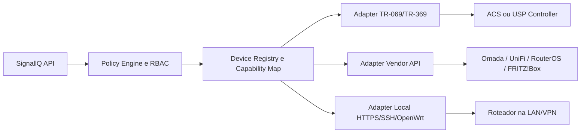
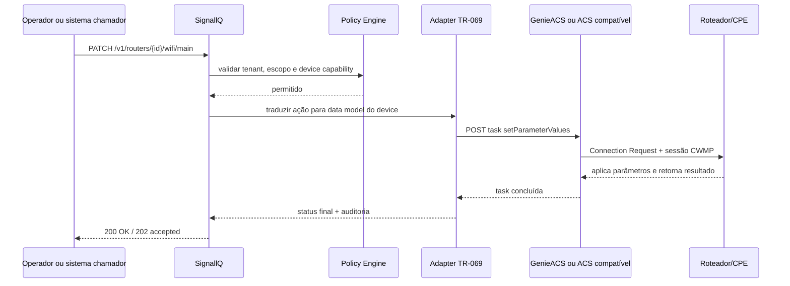

# Pesquisa sobre aplicativos e integrações para gestão unificada de modems, mesh e roteadores no Brasil

## Resumo executivo

Não existe, hoje, um **app de consumo realmente universal** que administre de forma suportada e estável modems, roteadores e kits mesh de múltiplas marcas no mercado brasileiro. O que existe, na prática, é uma combinação de três camadas: **apps do fabricante** para uso doméstico, **plataformas de gestão remota de CPE** baseadas em **TR-069/CWMP** ou **TR-369/USP** para ISPs e fabricantes, e **APIs públicas ou interfaces administrativas** em alguns ecossistemas mais abertos, como **MikroTik RouterOS**, **TP-Link Omada**, **Ubiquiti UniFi**, **FRITZ!Box TR-064** e **OpenWrt**. Para o contexto do Brasil, isso importa porque a base de banda larga fixa é enorme, com dezenas de milhões de acessos, e uma parcela relevante do parque é CPE gerenciado por provedor, não apenas roteador de varejo. citeturn31search1turn32search4turn35search1turn10search10turn22view1turn33search1turn19view1turn6search1turn21search6

Se o objetivo é permitir que o **SignallQ** leia status e execute ações básicas como **trocar senha do Wi‑Fi, alterar canal e verificar estado de conexão**, a arquitetura mais sensata não é integrar diretamente com apps móveis. Isso seria gambiarra frágil pra caralho. O caminho robusto é criar um **plano de controle unificado no SignallQ**, com **adapters por família de gerenciamento**: **TR-069/TR-181** para CPE/ISP, **vendor APIs oficiais** quando existirem, e **conectores locais** via HTTPS/SSH/OpenWrt apenas como fallback controlado. O motivo é simples: os apps móveis de consumo normalmente expõem UX, não uma API estável para terceiros. Já os padrões Broadband Forum e algumas plataformas corporativas foram feitos exatamente para automação. citeturn9search15turn9search3turn12search3turn13search12turn17search1turn10search10turn24search3turn33search1turn33search3turn22view0

Para **unificação real de ações**, o padrão mais útil é o **TR-181 Device:2**. Ele normaliza objetos como **`Device.WiFi.SSID.{i}.SSID`**, **`Device.WiFi.AccessPoint.{i}.Security.KeyPassphrase`** e **`Device.WiFi.Radio.{i}.Channel`**, além de suportar seleção automática de canal e topologias mais modernas de Wi‑Fi. Em roteadores mais antigos, ainda é comum cair no legado **`InternetGatewayDevice.*`** do TR-098/TR-069, então o SignallQ precisa manter um dicionário de equivalências por modelo e firmware. citeturn28view0turn28view1turn29view0turn29view2turn26search2turn35search17

No Brasil, em **presença prática de varejo e suporte local em português**, os apps/ecossistemas mais relevantes para casa e SMB ficam concentrados em **TP-Link Tether/Deco**, **Intelbras Wi‑Fi Control Home / Meu Wi‑Fi Intelbras / Remotize**, **MERCUSYS**, **ASUS Router**, **Tenda WiFi/CloudFi**, **Google Home para Nest Wifi/Google Wifi** e **HUAWEI AI Life**. Mas, para integração third-party séria, os mais promissores não são esses apps, e sim as superfícies oficiais de gestão como **GenieACS**, **Omada Open API**, **UniFi API**, **RouterOS REST/API** e **TR-064/USP no ecossistema FRITZ!Box**. citeturn13search12turn15search1turn17search1turn17search0turn14search0turn37search3turn38search1turn7search0turn39search3turn24search3turn33search1turn33search3turn22view0turn6search1

Se houver qualquer operação com credenciais do assinante, inventário de dispositivos conectados, endereço IP, MAC, ou telemetria associada ao cliente, o projeto já entra em terreno de **LGPD** e também precisa respeitar os requisitos mínimos de **segurança cibernética da Anatel para CPE**, obrigatórios para homologação desde **10 de março de 2024**. Em termos práticos: autenticação forte, segregação de privilégios, rotação de segredo, trilha de auditoria, minimização de dados e nada de expor interface web remota sem necessidade. citeturn32search0turn32search1turn32search4turn32search2turn22view0turn8search6

## Escopo e metodologia

Como não há um **ranking público, oficial e consolidado de “apps de roteador mais usados no Brasil”**, este relatório usa uma **priorização prática**, não um market share cravado. Os critérios foram: presença oficial no Brasil ou suporte em português, amplitude do portfólio local de roteadores/mesh/ONTs, existência de documentação pública sobre gerenciamento remoto e, quando disponível, sinais públicos de escala do app ou da plataforma. Em bom português: é um recorte útil pra produto e integração, não um ranking mágico tirado da bunda. citeturn13search12turn15search1turn16search2turn17search0turn14search0turn37search3turn38search1turn7search16turn39search3

Também separei o mercado em dois grupos, porque misturar tudo num balaio só dá análise torta. O primeiro grupo é o de **apps de consumo e SMB**: eles facilitam onboarding, mudança de senha, status da rede e alguma gestão remota. O segundo é o de **planos de gestão/provisionamento**: ACS, controladoras e APIs voltadas a automação e operação em escala. Para o SignallQ, o segundo grupo é o que realmente interessa como base de integração estável; o primeiro grupo interessa mais como evidência de recursos disponíveis por marca e como proxy da penetração prática no mercado brasileiro. citeturn12search3turn17search1turn14search4turn37search3turn38search1turn24search3turn33search1turn33search3turn22view1

## Apps e serviços mais relevantes no Brasil

### Apps de consumo e SMB com presença prática no Brasil

| App/serviço | Presença prática no Brasil | Marcas/modelos suportados | Descoberta e onboarding | Remoto/local | Autenticação e autorização | Leitura/escrita útil para SignallQ |
|---|---|---|---|---|---|---|
| **TP-Link Tether** | Muito alta no varejo doméstico pela presença da TP-Link Brasil e do portfólio local. citeturn13search12turn15search0 | Roteadores, roteadores xDSL, repetidores; em Mobile Wi‑Fi, todos os 5G e o M7000 4.0 no Tether. citeturn12search3turn15search0 | Smartphone conectado ao Wi‑Fi do equipamento; depois o app assume o setup. citeturn13search20 | Local e remoto; o remoto usa **TP-Link ID**. citeturn36search6turn36search4 | Senha admin do roteador e, para remoto, TP-Link ID. citeturn11search1turn36search4 | Status de dispositivo, clientes, permissões, SSID/senha e controles dos pais; bom como referência funcional, ruim como API third-party direta. citeturn13search0turn15search6 |
| **TP-Link Deco app** | Muito alta em mesh de varejo; a linha Deco tem forte presença local, com vários “mais vendidos”. citeturn36search1 | Linha **Deco** (ex.: X50, BE22, M5, S7). citeturn36search1 | Setup por app; há modelos com gestão web em `tplinkdeco.net`/`192.168.68.1`. citeturn36search2 | Local e remoto; o remoto depende de **TP-Link ID**. citeturn36search0turn36search4 | Conta proprietária TP-Link ID; alguns modelos permitem login web com essa conta. citeturn36search2turn36search4 | Forte para mesh doméstico; sem API pública oficial doméstica identificada nesta pesquisa. Para automação, Omada ou TR-069 são caminhos melhores. citeturn36search2turn33search1turn9search15 |
| **Intelbras Wi‑Fi Control Home** | Alta no mercado nacional, especialmente em linhas residenciais da Intelbras. citeturn11search4turn13search19 | **Twibi Giga/Fast**, **ACtion R 1200 / RF 1200 / RG 1200** e família correlata. citeturn13search3turn11search4 | App local; o smartphone deve estar conectado ao Wi‑Fi do roteador. citeturn13search3turn11search12 | **Local only** no app, segundo a página do Google Play. citeturn13search3 | Senha do equipamento; mudança de senha de login afeta os outros phones com o app. citeturn11search2 | Instalação, firmware, nome/senha, consumo de banda e filtros. Excelente pra UX local; péssimo como base única de gestão remota do SignallQ. citeturn11search0turn11search6 |
| **Meu Wi‑Fi Intelbras** | Alta em roteadores **Wi‑Force** e relevante para provedores por integração com Remotize. citeturn17search1turn17search4 | Linha **Wi‑Force** e modelos como **W5‑1200G**, **W5‑2100G**; integração com **Remotize** em vários SKUs. citeturn17search14turn16search7turn17search5 | Instalação por app; integração com plataforma cloud do provedor via Remotize. citeturn17search1turn17search0 | Local para o usuário; remoto quando acoplado ao **Remotize**. citeturn17search1turn17search0 | App do assinante + gestão central do provedor no Remotize. citeturn17search1turn17search0 | Muito interessante para SignallQ em cenários ISP/B2B2C com parque Intelbras. citeturn17search0turn16search7 |
| **MERCUSYS App** | Boa presença prática pelo crescimento da Mercusys no Brasil e foco em entrada/mesh. citeturn9search19turn14search0 | Todos os **Halo Mesh** e alguns roteadores compatíveis, como **MR70X** e **MR30G**. citeturn14search0 | App de setup e gerenciamento; material oficial cita gestão em casa ou fora. citeturn14search20turn14search4 | Local e remoto via app. citeturn14search0turn14search20 | Conta/app do fabricante; recursos variam por modelo e versão. citeturn14search4 | Boa gama doméstica e TR‑069 documentado para linha voltada a ISPs, o que aumenta o interesse para SignallQ. citeturn14search0turn9search3 |
| **ASUS Router** | Presença média-alta no segmento premium/entusiasta e mesh AiMesh/ZenWiFi. citeturn15search2turn37search3 | Toda a linha **ZenWiFi**, Wi‑Fi 7/6/AX, ROG, TUF, Lyra e diversos RT‑AC/AX. citeturn15search2 | Onboarding com permissão de **Bluetooth** no app; gestão de múltiplos roteadores. citeturn37search11turn37search14 | Local e remoto; a conexão remota pode ser habilitada no app. citeturn37search1turn13search1 | Login do roteador no app/web; pode exigir redefinição se credenciais forem esquecidas. citeturn37search9turn37search14 | Bom para SMB doméstico avançado; dá pra integrar, mas por app não é a melhor rota. Melhor usar HTTPS/SSH/GUI ou API quando existir por modelo. citeturn37search1turn37search3 |
| **Google Home para Nest Wifi / Google Wifi** | Nicho relevante, mas menor que TP-Link/Intelbras no Brasil; ainda assim é ecossistema importante. citeturn7search16turn13search14 | **Google Wifi**, **Nest Wifi**, **Nest Wifi Pro**. citeturn7search16turn7search23 | Setup via **QR code** no Google Home. citeturn7search16turn7search23 | Gestão pela nuvem/conta Google, com membros da casa e permissões. citeturn7search18turn7search21 | Conta Google; quem pode gerenciar a rede depende do papel na casa. citeturn7search18turn7search9 | Permite mudar senha e nome do Wi‑Fi, criar rede de convidados e ver status; o app Google Wifi legado está em leitura. citeturn7search0turn7search6turn7search1turn7search18 |
| **HUAWEI AI Life** | Presença média em roteadores/mesh Huawei. citeturn39search3turn14search2 | Roteadores e Wi‑Fi mesh Huawei compatíveis com AI Life. citeturn14search2turn39search7 | Pode detectar roteador novo ou resetado automaticamente; em uso normal costuma exigir telefone conectado ao Wi‑Fi do roteador. citeturn39search11turn39search5 | Gestão principalmente pelo app e HUAWEI ID. citeturn14search14turn39search1 | Login com **HUAWEI ID** vinculado ao roteador. citeturn39search1turn14search14 | Bom para estado da rede, convidados, dispositivos conectados e diagnóstico; API third-party pública não apareceu na documentação oficial pesquisada. citeturn39search3turn39search19 |
| **Tenda WiFi** | Presença média em entrada e mesh; Tenda também opera no Brasil com docs em português. citeturn38search0turn38search10 | Roteadores como **AC5**, **AX3/TX3+/RX3/TX9 Pro/RX9 Pro+**, sistemas mesh como **MW3/MW6** e extensores. citeturn38search0turn38search10turn38search13 | Registro/binding de conta Tenda no app; há suporte a gestão remota e cloud em vários modelos. citeturn38search0turn38search8turn38search13 | Local e remoto. citeturn38search10turn38search13 | Conta Tenda + binding do admin account ao app/cloud. citeturn38search0turn38search8 | Útil para o parque Tenda; para integração programática, a linha **CloudFi** é mais interessante que o app doméstico. citeturn38search1turn38search10 |

**Leitura prática dessa tabela:** para usuário final no Brasil, **TP-Link** e **Intelbras** carregam o peso maior; **MERCUSYS**, **ASUS** e **Tenda** vêm logo atrás em cenários específicos; **Google** e **Huawei** são ecossistemas mais fechados e menos “universais”. Para o SignallQ, esses apps servem mais para entender **o que a marca consegue fazer** do que como interface de integração de verdade. citeturn13search12turn17search1turn14search0turn37search3turn38search1turn7search0turn39search3

### Plataformas e APIs mais úteis para automação e operação

| Plataforma/API | Onde encaixa | Protocolos/superfícies | Autenticação/autorização | O que dá para fazer |
|---|---|---|---|---|
| **TR-069/CWMP + GenieACS** | ISP, parque heterogêneo, CPE legado e atual. citeturn12search22turn24search3 | CWMP/TR‑069, modelos TR‑098/TR‑181, NBI REST do GenieACS. citeturn35search1turn24search3 | Auth CPE→ACS, ACS→CPE/Connection Request, TLS opcional, RBAC no ACS. citeturn12search1turn12search0turn1search12 | Ler parâmetros, setar SSID/senha/canal, reboot, firmware, tags, presets e provisioning em escala. citeturn25search3turn24search4 |
| **TR-369/USP** | Evolução moderna para managed Wi‑Fi, mesh e casa conectada. citeturn10search10turn10search19 | USP Agent/Controller, conexões persistentes seguras, data models USP. citeturn10search10turn10search4turn10search11 | Multi-controller, segurança integrada e controle mais granular. citeturn10search8turn10search11 | Melhor para futuro do SignallQ se o alvo inclui CPE moderno, Wi‑Fi mesh e device ecosystems mais novos. citeturn10search18turn10search19 |
| **Intelbras Remotize** | Provedores com parque Intelbras. citeturn17search0turn17search5 | Plataforma cloud Intelbras; integração com Wi‑Force, ONTs WiFiber e ONUs. citeturn17search0turn17search3turn17search6 | Gestão centralizada por conta do provedor. citeturn17search0 | Estatísticas, associação simplificada, firmware e operação do parque em campo. citeturn17search0turn17search5 |
| **TP-Link Omada Open API** | SMB/Enterprise, ambientes com controladora Omada. citeturn18search2turn33search0 | REST API da controladora. citeturn18search0turn18search2 | **OAuth 2.0**, com authorization code ou client mode, token temporário, client ID/secret. citeturn33search0turn33search1turn33search10 | Automação de sites, status de rede, controle e integração com terceiros. citeturn18search4turn18search5 |
| **UniFi Site Manager API e APIs locais** | SMB/Enterprise/instalações avançadas Ubiquiti. citeturn19view1 | Site Manager API e APIs locais por aplicação. citeturn19view1 | **API Key** gerada no Site Manager; documentação no developer portal. citeturn33search3turn33search9 | Inventário de sites/dispositivos, Internet Health, status e analytics; ótimo para leitura e automação de instalações UniFi. citeturn19view1turn33search11turn33search12 |
| **MikroTik RouterOS REST/API** | ISPs pequenos, WISPs, SMB e power users. citeturn22view1turn22view0 | API nativa RouterOS + REST `/rest`. citeturn22view1turn22view0 | HTTP Basic Auth; recomendado usar HTTPS/`www-ssl`; API em portas 8728/8729. citeturn22view0turn22view1turn8search6 | Leitura, update e CRUD em recursos com semântica próxima da CLI. citeturn22view0turn22view1 |
| **FRITZ!Box TR-064** | Casas e SMBs em ecossistema FRITZ. citeturn6search1turn6search3 | TR‑064, extensões AVM e suporte até a controller USP em docs recentes. citeturn6search1 | Usuário/senha da interface; AVM documenta autenticação e 2FA em extensões TR‑064. citeturn6search3turn6search1 | Consultar e reconfigurar diversas funções do roteador sem raspar a UI web. citeturn6search0turn6search1 |
| **OpenWrt ubus/rpcd** | Integração local e firmware aberto. citeturn21search6turn21search7 | ubus, rpcd, sessões e ACLs. citeturn21search18turn21search17 | `session.login`, timeout de sessão e ACL por objeto/método. citeturn21search18turn21search17 | Excelente para adapter local do SignallQ quando o cliente usa OpenWrt ou firmware derivado. citeturn21search6turn21search7 |

## Protocolos, APIs e métodos de descoberta

O ponto central aqui é o seguinte: **universalização via app é fraca; universalização via plano de gerenciamento é forte**. Para frota de CPE, o padrão campeão continua sendo **TR‑069/CWMP**, porque ele foi criado justamente para permitir que um **ACS** gerencie, configure, monitore e faça troubleshooting remoto em equipamentos do assinante por XML/SOAP sobre HTTP/HTTPS. Em 2026, o **USP/TR‑369** já é o caminho mais moderno para managed Wi‑Fi, mesh e ecossistemas conectados, porque suporta **conexões persistentes e seguras** e arquitetura com múltiplos controllers. citeturn9search15turn35search1turn10search10turn10search11turn10search18

No **TR‑181**, que é o modelo mais útil para SignallQ, a mudança de credenciais e rádio pode ser normalizada com parâmetros como **`Device.WiFi.SSID.{i}.SSID`**, **`Device.WiFi.AccessPoint.{i}.Security.KeyPassphrase`**, **`Device.WiFi.Radio.{i}.Channel`** e **`Device.WiFi.Radio.{i}.AutoChannelEnable`**. Já o estado do SSID e da WAN pode vir de **`Device.WiFi.SSID.{i}.Status`** ou, em modelos legados, de **`InternetGatewayDevice.WANDevice...WANIPConnection...ConnectionStatus`**. Isso evita scraping tosco de web admin e reduz dependência de app. citeturn29view0turn28view0turn28view1turn29view2turn27view0turn26search2

No lado de **descoberta e bootstrap remoto**, o TR‑069 combina algumas peças importantes. O CPE mantém dados de **ManagementServer**, incluindo **URL do ACS**, **ConnectionRequestURL**, **username/password** para a conexão de request e pode usar meios de bootstrap definidos no ecossistema CWMP, inclusive com DHCP/vendor options em cenários suportados. Em operação, o ACS enfileira tarefas e pode disparar **connection request** imediata, em vez de esperar o próximo inform periódico. citeturn35search17turn35search7turn24search1turn24search3

No mundo local, **UPnP/IGD** serve bem para **descoberta e controle em LAN**, mas ele não é o canivete suíço que muita gente imagina. A própria arquitetura UPnP enfatiza a fase de **Discovery** e a relação entre control points e devices na rede local, enquanto o IGD é focado em gateway doméstico e controle de portas/NAT, não em uma automação remota universal e segura de configurações administrativas críticas. Em outras palavras: ótimo para descobrir e falar com gateway em LAN; fraco como base para trocar senha Wi‑Fi de qualquer fabricante pela Internet. citeturn30search5turn30search1turn8search15turn8search3

Para **HTTP/HTTPS, SSH e SNMP**, o jogo muda. Eles são mais “universais” do ponto de vista técnico, mas menos padronizados semanticamente. **HTTP/HTTPS** funciona como transporte para web UIs e vendor APIs; **HTTP Basic Auth** existe, mas só presta com **TLS**, senão as credenciais ficam expostas; **SSH** é excelente para gestão segura de CLI, e **SNMPv3** oferece modelo de segurança e acesso muito melhor que SNMPv1/v2c, com **USM** e **VACM**. O problema é que, para ações como **trocar senha do Wi‑Fi**, SNMP costuma servir mais para leitura/monitoramento do que para operação de configuração padronizada em CPE doméstico. citeturn8search14turn8search6turn8search18turn8search1turn8search9turn40search11turn8search4turn40search0

### Comparativo técnico dos principais protocolos e superfícies

| Protocolo/API | Descoberta / provisionamento | Leitura | Escrita | Auth/AuthZ | Onde é forte | Onde quebra |
|---|---|---|---|---|---|---|
| **TR‑069/CWMP** | ACS URL, inform periódico, connection request, bootstrap do ecossistema CWMP. citeturn35search17turn24search1 | Muito boa. citeturn24search3 | Muito boa via tasks/provisions. citeturn25search3turn24search4 | Credenciais CPE/ACS, request auth e TLS quando configurado. citeturn12search1turn1search12 | Frota heterogênea e escala ISP. | Dependência de suporte do firmware e mapeamento correto do data model. |
| **TR‑369/USP** | Controller/Agent com conexão persistente segura. citeturn10search10turn10search11 | Muito boa. | Muito boa. | Modelo moderno de segurança e multi-controller. citeturn10search8turn10search11 | Managed Wi‑Fi moderno, mesh, ecossistemas conectados. | Adoção ainda não é universal em todo parque legado. |
| **Vendor API oficial** | Depende do ecossistema; geralmente controller/cloud. citeturn33search1turn33search3turn22view0 | Muito boa. | Muito boa. | OAuth2, API key, Basic+TLS, ou login do equipamento. citeturn33search0turn33search3turn22view0 | Automação confiável quando o fabricante publicou docs. | Cobertura limitada por marca/ecossistema. |
| **HTTPS/Web admin** | Normalmente local; às vezes remoto. citeturn36search7turn37search6turn38search16 | Média. | Média/alta, mas sem padronização. | Web login; Basic/Digest/cookies/token variam. citeturn8search18turn8search6 | Fallback local e debugging. | Raspar UI é frágil, suscetível a firmware changes. |
| **SSH/CLI** | IP conhecido/VPN/bastion. citeturn8search1turn8search5 | Alta. | Alta. | Password, public key, host verification. citeturn8search9turn8search1 | Equipamentos mais “profissionais”. | Quase inexistente em CPE doméstico bloqueado por ISP. |
| **SNMPv3** | Polling por IP/MIB. citeturn40search11turn8search4 | Alta em monitoramento. | Moderada em escrita; depende de MIB e device. | USM + VACM. citeturn8search4turn40search0 | Telemetria e inventário. | Pouco elegante para configuração Wi‑Fi em parque doméstico. |
| **UPnP/IGD** | Discovery local por UPnP. citeturn30search5turn30search1 | Baixa/média. | Limitada e focada em gateway/NAT. citeturn8search15turn8search3 | Modelo de segurança insuficiente para admin remota universal. | Descoberta em LAN e port mapping. | Não é base séria para SignallQ fazer gestão remota padronizada. |

## Arquiteturas de integração com SignallQ

A arquitetura recomendada para o SignallQ é um **façade northbound** único, com controle de política e RBAC, e **adapters southbound** por família de dispositivo. O segredo é que o SignallQ nunca conversa “com o app”; ele conversa com o **plano de gerenciamento** correto para aquele equipamento. Isso reduz acoplamento ao fabricante, isola diferenças de firmware e permite auditar quem mudou o quê, quando e por qual ação. citeturn24search3turn33search1turn33search3turn22view0turn21search18



Esse desenho bate com o que a documentação oficial dos padrões e plataformas permite: **ACS/Controller** para parque gerenciado, **API key/OAuth2** para controladoras e clouds publicadas, e **interfaces locais** quando o equipamento é administrável na rede local e o cenário admite isso. citeturn24search3turn10search10turn33search0turn33search3turn22view0turn21search18

### Fluxo recomendado para CPE e roteadores gerenciados por provedor



Esse fluxo usa o modelo oficial do **GenieACS NBI**, que permite enfileirar tasks, opcionalmente desencadear **connection request** imediata e depois recuperar os parâmetros do device. citeturn24search1turn24search3turn25search3

### Endpoints northbound sugeridos para o SignallQ

Abaixo está uma proposta de API northbound. Ela é uma recomendação de desenho, pensada para esconder a sujeira dos fabricantes e expor só **capacidades normalizadas**.

```http
GET /v1/routers/{routerId}/status
Authorization: Bearer <jwt>
```

**Resposta sugerida**
```json
{
  "routerId": "br-sp-000123",
  "brand": "Intelbras",
  "model": "W5-2100G",
  "managementPlane": "tr069",
  "wan": {
    "status": "Connected",
    "ip": "203.0.113.24"
  },
  "wifi": [
    {
      "band": "2.4GHz",
      "ssid": "Casa-24",
      "channel": 6,
      "autoChannel": false,
      "status": "Up"
    },
    {
      "band": "5GHz",
      "ssid": "Casa-5G",
      "channel": 44,
      "autoChannel": true,
      "status": "Up"
    }
  ],
  "lastSeenAt": "2026-07-05T18:10:11Z"
}
```

```http
PATCH /v1/routers/{routerId}/wifi/main
Authorization: Bearer <jwt>
Content-Type: application/json
```

**Payload sugerido**
```json
{
  "ssid": "MinhaRedeNova",
  "passphrase": "NovaSenhaSegura#2026",
  "applyMode": "immediate",
  "reason": "customer_request",
  "actor": {
    "type": "operator",
    "id": "atendimento-42"
  }
}
```

```http
POST /v1/routers/{routerId}/radio/channel
Authorization: Bearer <jwt>
Content-Type: application/json
```

**Payload sugerido**
```json
{
  "band": "5GHz",
  "channel": 149,
  "autoChannel": false,
  "reason": "interference_mitigation"
}
```

```http
POST /v1/routers/{routerId}/radio/channel/optimize
Authorization: Bearer <jwt>
Content-Type: application/json
```

**Payload sugerido**
```json
{
  "band": "2.4GHz",
  "autoChannel": true,
  "reason": "self_heal"
}
```

A lógica de permissão deveria ser por **escopos mínimos**, por exemplo: `router:read`, `router:wifi.write`, `router:radio.write`, `router:wan.read`, `router:reboot`. Isso conversa bem com o que plataformas como **GenieACS** e **Omada** já fazem em termos de regras, tasks, roles e tokens. citeturn12search0turn24search3turn33search0

### Mapeamento southbound sugerido

| Capacidade no SignallQ | Mapeamento preferencial | Exemplo de parâmetro/chamada |
|---|---|---|
| `router.status.read` | TR‑181/TR‑098, UniFi, Omada, RouterOS, OpenWrt | `Device.WiFi.SSID.{i}.Status`; `WANIPConnection.ConnectionStatus`; métricas/health nas APIs de controller. citeturn27view0turn26search2turn19view1turn33search12 |
| `router.wifi.passphrase.write` | TR‑181; fallback vendor API local/cloud | `Device.WiFi.AccessPoint.{i}.Security.KeyPassphrase`. citeturn28view0turn28view3 |
| `router.wifi.ssid.write` | TR‑181; fallback vendor API local/cloud | `Device.WiFi.SSID.{i}.SSID`. citeturn29view0 |
| `router.radio.channel.write` | TR‑181; fallback vendor API local/cloud | `Device.WiFi.Radio.{i}.Channel` + `AutoChannelEnable`. citeturn28view1turn29view2 |
| `router.inventory.read` | TR‑181 AssociatedDevice, UniFi/Omada/OpenWrt/Huawei app-equivalent capabilities | `Device.WiFi.AccessPoint.{i}.AssociatedDevice.{i}` e APIs de controller. citeturn28view3turn19view1turn18search4 |

### Exemplo realista com GenieACS

**Ler parâmetros agora**
```http
POST /devices/00236a-SR552n-SR552NA084%252D0003269/tasks?timeout=3000&connection_request
Content-Type: application/json

{
  "name": "getParameterValues",
  "parameterNames": [
    "Device.WiFi.SSID.1.SSID",
    "Device.WiFi.AccessPoint.1.Security.KeyPassphrase",
    "Device.WiFi.Radio.1.Channel"
  ]
}
```

**Alterar SSID e senha**
```http
POST /devices/00236a-SR552n-SR552NA084%252D0003269/tasks?timeout=3000&connection_request
Content-Type: application/json

{
  "name": "setParameterValues",
  "parameterValues": [
    ["Device.WiFi.SSID.1.SSID", "MinhaRedeNova"],
    ["Device.WiFi.AccessPoint.1.Security.KeyPassphrase", "NovaSenhaSegura#2026"]
  ]
}
```

**Ativar seleção automática de canal**
```http
POST /devices/00236a-SR552n-SR552NA084%252D0003269/tasks?timeout=3000&connection_request
Content-Type: application/json

{
  "name": "setParameterValues",
  "parameterValues": [
    ["Device.WiFi.Radio.1.AutoChannelEnable", true]
  ]
}
```

Os formatos acima refletem a API NBI documentada do **GenieACS** e os nomes de parâmetros do **TR‑181**. Em device legado, o adapter do SignallQ teria de traduzir para o ramo `InternetGatewayDevice.*` correspondente. citeturn25search3turn24search3turn28view0turn28view1turn29view0turn29view2

### Exemplo de integração com RouterOS REST para leitura

```http
GET https://router.example.net/rest/system/resource
Authorization: Basic <credenciais>
```

**Resposta típica**
```json
{
  "cpu-load": "4",
  "free-memory": "1503133696",
  "uptime": "2d20h12m20s",
  "version": "7.x"
}
```

Na documentação oficial do RouterOS, o **REST API** fica sob `/rest`, usa **HTTP Basic Auth** e o próprio fabricante recomenda **não usar HTTP sem TLS** em produção. Isso o torna bom para leitura e automação em ambientes controlados, desde que o SignallQ o acesse por VPN, bastion ou canal privado. citeturn22view0turn8search6

## Limitações, riscos de segurança e conformidade

A maior limitação real dessa porra toda é esta: **a maioria dos apps domésticos populares não foi feita para integração third‑party estável**. Eles foram feitos para UX do cliente final. Quando um fabricante publica de verdade uma API suportada, ele normalmente a prende a uma **controladora**, um **cloud manager** ou um **sistema operacional de rede** específico — exatamente o caso de **Omada**, **UniFi**, **RouterOS**, **GenieACS**, **FRITZ!Box TR‑064** e **OpenWrt**. Isso empurra a arquitetura do SignallQ para adapters e capability mapping, e não para “um SDK universal de app de roteador”. citeturn33search1turn33search3turn22view0turn24search3turn6search1turn21search18

Em segurança, os riscos conhecidos são bem objetivos. **HTTP Basic Auth sem TLS** é ruim porque as credenciais podem ser capturadas; o próprio MikroTik alerta contra habilitar HTTP em produção. Expor **gerenciamento web remoto** direto na Internet amplia a superfície de ataque; a própria TP-Link sugere preferir o app oficial a abrir a interface para acesso direto, e também recomenda restringir IP remoto quando o recurso web for usado. No ecossistema FRITZ!Box, a AVM historicamente corrigiu problemas no contexto **TR‑064** e reforçou restrições em ações sensíveis; isso mostra que o vetor é útil, mas precisa de hardening e firmware atualizado. citeturn22view0turn8search6turn36search6turn36search7turn6search5turn6search14

Outro risco óbvio é tratar **mudança de senha Wi‑Fi** como operação banal. Ela derruba ou despareia cliente, pode ferrar IoT em massa e vira bomba de suporte se for disparada sem janelas, rollback e confirmação contextual. No seu SignallQ, essa ação deveria exigir escopo diferente de leitura, generating audit trail, e idealmente suportar **dry-run**, **scheduled apply** e política de comunicação ao usuário final. Isso é coerente com os princípios de privilegio mínimo presentes em **SNMPv3/VACM**, **roles and permissions** do GenieACS e com a necessidade regulatória de governança sobre dados e configurações do assinante. citeturn40search0turn12search0turn32search0

Do ponto de vista regulatório brasileiro, há pelo menos três obrigações práticas. A primeira é usar e priorizar **equipamentos homologados** e ecossistemas que atendam aos requisitos mandatórios de segurança para **CPE** definidos pela **Anatel**, aplicáveis a cable modem, xDSL modem, ONU/ONT e roteadores/modems FWA, com obrigatoriedade na homologação desde **10/03/2024**. A segunda é tratar logs, inventário e credenciais sob uma ótica compatível com a **LGPD**. A terceira é seguir práticas básicas de higiene de segurança que o **CERT.br** repete há anos: evitar senhas padrão, manter firmware atualizado e privilegiar **WPA**, **HTTPS**, **SSH** e outras formas cifradas de acesso. citeturn32search4turn32search1turn32search0turn32search2turn32search11

A recomendação objetiva para o SignallQ fica assim. Para **provedor/ISP** e CPE de campo: **TR‑069 agora**, com trilha de migração para **USP/TR‑369**. Para **controladoras e redes SMB/Enterprise**: integrar **Omada**, **UniFi**, **RouterOS** e, quando houver, **FRITZ!Box TR‑064**. Para **roteadores de consumo sem API publicada**: tratar como **best effort local integration** via HTTPS/SSH/OpenWrt, sempre com suporte por modelo e firmware, sem vender ao cliente a ilusão de “universal”. Se você tentar pular essa hierarquia e plugar direto em app/cloud doméstico, vai comprar dívida técnica e suporte infernal. citeturn10search10turn24search3turn33search1turn33search3turn22view0turn6search1turn21search18

## Perguntas para refinar

Antes de fechar uma arquitetura alvo para o SignallQ, ainda faltam cinco definições que mudam bastante a solução:

1. **O SignallQ é um produto interno ou de terceiros?**  
   Isso define se você pode assumir credenciais de provedor, uso de ACS existente, ou se precisa operar como integrador neutro com consentimento explícito do cliente.

2. **A integração precisa ser via cloud-to-device, via rede local, ou as duas?**  
   Cloud-to-device favorece ACS, controller APIs e plataformas como Remotize/Omada/UniFi. Rede local favorece OpenWrt, RouterOS, web admin e conectores on-prem.

3. **Quais são as marcas e os modelos-alvo?**  
   Sem isso, o máximo honesto é uma arquitetura genérica. Com isso, dá para montar uma matriz real de capabilities por firmware e reduzir muito a gambiarra.

4. **Quais são os requisitos de conformidade e regulamentação?**  
   Ex.: LGPD, retenção de logs, consentimento do assinante, necessidade de uso exclusivo de equipamentos homologados, segregação por tenant, trilha de auditoria e MFA de operador.

5. **Qual é o nível de acesso desejado?**  
   **Somente leitura**, **leitura + escrita**, ou escrita restrita a certas ações como trocar senha, alterar canal e reboot. Essa resposta muda totalmente RBAC, modelo de risco e experiência operacional.